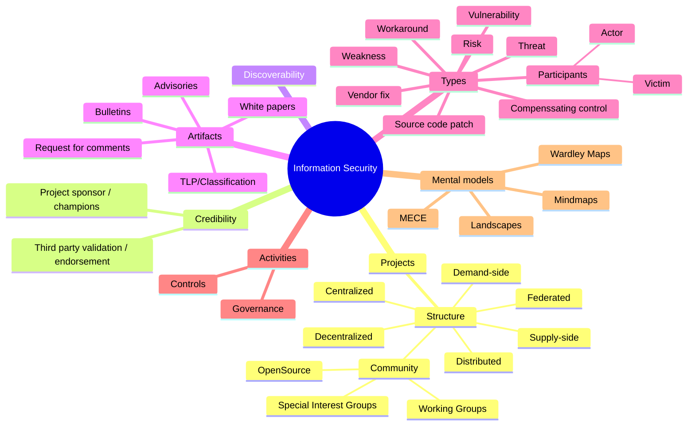

```mermaid
mindmap
  root((Information Security))
    Projects
      Structure
        Centralized
        Decentralized
        Federated
        Distributed
        Supply-side
        Demand-side
        Community
          OpenSource
          Working Groups
          Special Interest Groups
    Credibility
      Third party validation / endorsement
      Project sponsor / champions
    Discoverability
    Artifacts
      White papers
      Request for comments
      Advisories
      Bulletins
      TLP/Classification
    Types
      Vulnerability
      Threat
      Risk
      Weakness
      Workaround
      Compenssating control
      Vendor fix
      Source code patch
      Participants
        Actor
        Victim
    Activities
      Governance
      Controls
    Mental models
      Mindmaps
      Wardley Maps
      MECE
      Landscapes
```
